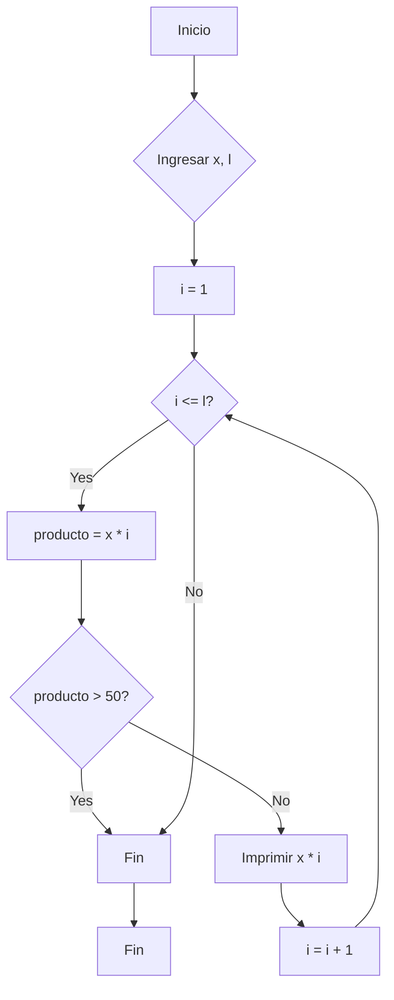

**2. Tabla de multiplicar con límite:**

*   **Diagrama de Flujo:**



*   **Pseudocódigo:**

```
INICIO
    ENTRADA x, l
    i = 1
    MIENTRAS i <= l HACER
        producto = x * i
        SI producto > 50 ENTONCES
            SALIR DEL BUCLE
        FINSI
        IMPRIMIR x * i
        i = i + 1
    FINMIENTRAS
FIN
```

*   **Código C++:**

```cpp
#include <iostream>

using namespace std;

int main() {
  int x, l;

  cout << "Ingrese el número para la tabla de multiplicar: ";
  cin >> x;
  cout << "Ingrese el límite: ";
  cin >> l;

  for (int i = 1; i <= l; ++i) {
    int producto = x * i;
    if (producto > 50) {
      break; // Sale del bucle si el producto excede 50
    }
    cout << x << " * " << i << " = " << producto << endl;
  }

  return 0;
}
```
