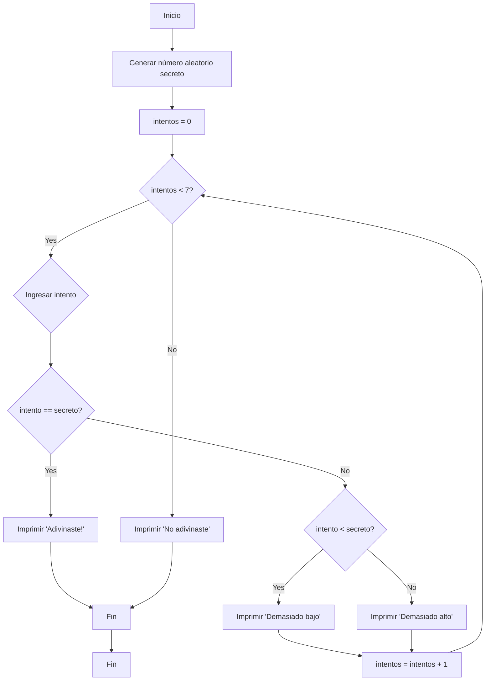

**3. Adivina el número (con pistas):**

*   **Diagrama de Flujo:**



*   **Pseudocódigo:**

```
INICIO
    secreto = GENERAR_NUMERO_ALEATORIO(1, 100)
    intentos = 0
    MIENTRAS intentos < 7 HACER
        ENTRADA intento
        SI intento == secreto ENTONCES
            IMPRIMIR "¡Adivinaste!"
            SALIR DEL PROGRAMA
        SINO SI intento < secreto ENTONCES
            IMPRIMIR "Demasiado bajo"
        SINO
            IMPRIMIR "Demasiado alto"
        FINSI
        intentos = intentos + 1
    FINMIENTRAS
    IMPRIMIR "No adivinaste. El número era " + secreto
FIN
```

*   **Código C++:**

```cpp
#include <iostream>
#include <cstdlib> // Para rand() y srand()
#include <ctime>   // Para time()

using namespace std;

int main() {
  // Inicializar el generador de números aleatorios
  srand(time(0));
  int secreto = rand() % 100 + 1; // Genera un número entre 1 y 100
  int intento, intentos = 0;

  cout << "Adivina el número entre 1 y 100." << endl;

  while (intentos < 7) {
    cout << "Intento #" << intentos + 1 << ": ";
    cin >> intento;

    if (intento == secreto) {
      cout << "¡Adivinaste! El número era " << secreto << endl;
      return 0; // Termina el programa
    } else if (intento < secreto) {
      cout << "Demasiado bajo." << endl;
    } else {
      cout << "Demasiado alto." << endl;
    }

    intentos++;
  }

  cout << "No adivinaste. El número era " << secreto << endl;
  return 0;
}
```
