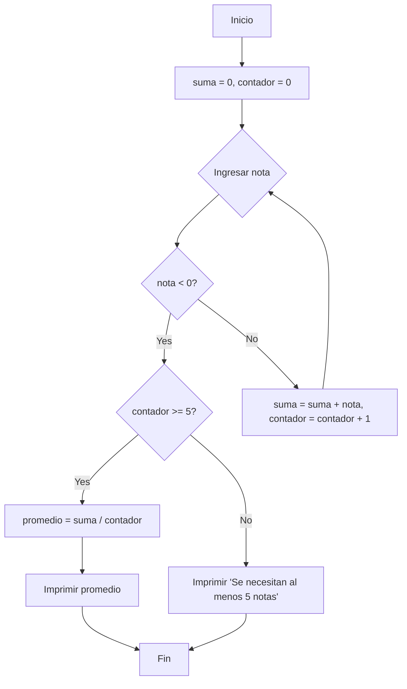

**5. Calculadora de promedio con límite de notas:**

*   **Diagrama de Flujo (Mermaid):**



*   **Pseudocódigo:**

```
INICIO
    suma = 0
    contador = 0
    REPETIR
        ENTRADA nota
        SI nota < 0 ENTONCES
            SALIR DEL BUCLE
        FINSI
        suma = suma + nota
        contador = contador + 1
    FINREPETIR

    SI contador >= 5 ENTONCES
        promedio = suma / contador
        IMPRIMIR promedio
    SINO
        IMPRIMIR "Se necesitan al menos 5 notas para calcular el promedio"
    FINSI
FIN
```

*   **Código C++:**

```cpp
#include <iostream>

using namespace std;

int main() {
  float nota, suma = 0.0;
  int contador = 0;

  cout << "Ingrese las notas (ingrese un número negativo para terminar):" << endl;

  while (true) {
    cout << "Nota " << contador + 1 << ": ";
    cin >> nota;

    if (nota < 0) {
      break; // Sale del bucle si la nota es negativa
    }

    suma += nota;
    contador++;
  }

  if (contador >= 5) {
    float promedio = suma / contador;
    cout << "El promedio de las notas es: " << promedio << endl;
  } else {
    cout << "Se necesitan al menos 5 notas para calcular el promedio." << endl;
  }

  return 0;
}
```