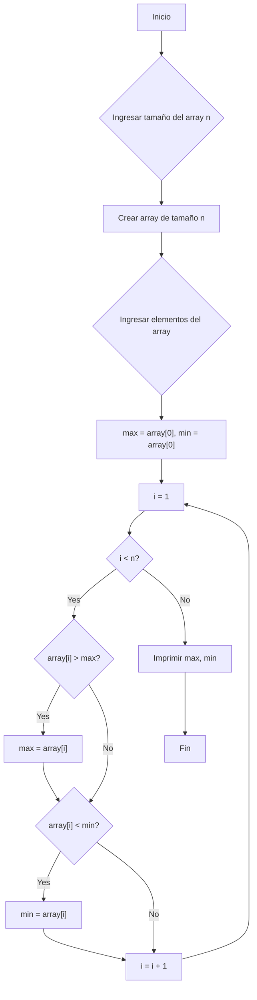
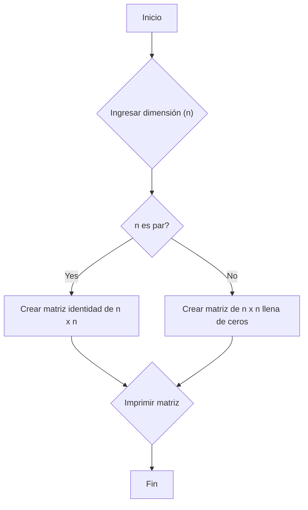

1.  Para cada enunciado, creen un diagrama de flujo y un pseudocódigo.
2.  Luego, escriban el código C++ correspondiente.
3.  Finalmente, comparen su código con las respuestas proporcionadas.

¡Entendido! Aquí están los tres primeros ejercicios de la lista original, con el tercero modificado para que solo calcule y (condicionalmente) imprima la diagonal principal:

**Enunciados de los ejercicios:**

1.  **Buscador de Máximo y Mínimo en Array Unidimensional:** Escribe un programa que pida al usuario el tamaño de un array unidimensional de enteros. Luego, permite al usuario ingresar los elementos del array. El programa debe encontrar y mostrar el valor máximo y el valor mínimo del array.

2.  **Matriz Identidad Condicional:** Crea un programa que pida al usuario la dimensión de una matriz cuadrada. El programa debe crear una matriz identidad de esa dimensión, pero solo si la dimensión es un número par. Si la dimensión es impar, debe llenar la matriz con ceros. Imprime la matriz resultante.

3.  **Suma de Diagonal Principal (con Condición):** Escribe un programa que pida al usuario la dimensión de una matriz cuadrada. Luego, permite al usuario ingresar los elementos de la matriz. El programa debe calcular la suma de los elementos de la diagonal principal. Si la suma de la diagonal principal es mayor que 100, imprime la diagonal principal; de lo contrario, imprime un mensaje indicando que la suma no superó el valor 100.

**Soluciones :**

**1. Buscador de Máximo y Mínimo en Array Unidimensional:**

*   **Diagrama de Flujo (Mermaid):**



*   **Pseudocódigo:**

```
INICIO
    ENTRADA n (tamaño del array)
    CREAR array[n]
    PARA i = 0 HASTA n-1 HACER
        ENTRADA array[i]
    FINPARA
    max = array[0]
    min = array[0]
    PARA i = 1 HASTA n-1 HACER
        SI array[i] > max ENTONCES
            max = array[i]
        FINSI
        SI array[i] < min ENTONCES
            min = array[i]
        FINSI
    FINPARA
    IMPRIMIR "Máximo: " + max
    IMPRIMIR "Mínimo: " + min
FIN
```

*   **Código C++:**

```cpp
#include <iostream>
#include <limits> // Para usar numeric_limits

using namespace std;

int main() {
  int n;

  cout << "Ingrese el tamaño del array: ";
  cin >> n;

  int array[n]; // Creación del array

  cout << "Ingrese los elementos del array:" << endl;
  for (int i = 0; i < n; ++i) {
    cin >> array[i];
  }

  int max = array[0];
  int min = array[0];

  for (int i = 1; i < n; ++i) {
    if (array[i] > max) {
      max = array[i];
    }
    if (array[i] < min) {
      min = array[i];
    }
  }

  cout << "Máximo: " << max << endl;
  cout << "Mínimo: " << min << endl;

  return 0;
}
```

**2. Matriz Identidad Condicional:**

*   **Diagrama de Flujo (Mermaid):**



*   **Pseudocódigo:**

```
INICIO
    ENTRADA n (dimensión de la matriz)
    SI n es par ENTONCES
        CREAR matriz[n][n] (matriz identidad)
        PARA i = 0 HASTA n-1 HACER
            PARA j = 0 HASTA n-1 HACER
                SI i == j ENTONCES
                    matriz[i][j] = 1
                SINO
                    matriz[i][j] = 0
                FINSI
            FINPARA
        FINPARA
    SINO
        CREAR matriz[n][n] (matriz llena de ceros)
        PARA i = 0 HASTA n-1 HACER
            PARA j = 0 HASTA n-1 HACER
                matriz[i][j] = 0
            FINPARA
        FINPARA
    FINSI
    IMPRIMIR matriz
FIN
```

*   **Código C++:**

```cpp
#include <iostream>

using namespace std;

int main() {
  int n;

  cout << "Ingrese la dimensión de la matriz cuadrada: ";
  cin >> n;

  int matriz[n][n];

  if (n % 2 == 0) {
    // Crear matriz identidad
    for (int i = 0; i < n; ++i) {
      for (int j = 0; j < n; ++j) {
        if (i == j) {
          matriz[i][j] = 1;
        } else {
          matriz[i][j] = 0;
        }
      }
    }
  } else {
    // Llenar la matriz con ceros
    for (int i = 0; i < n; ++i) {
      for (int j = 0; j < n; ++j) {
        matriz[i][j] = 0;
      }
    }
  }

  // Imprimir la matriz
  cout << "La matriz resultante es:" << endl;
  for (int i = 0; i < n; ++i) {
    for (int j = 0; j < n; ++j) {
      cout << matriz[i][j] << " ";
    }
    cout << endl;
  }

  return 0;
}
```

**3.

**Enunciados de los programas:**

1.  **Suma condicional de pares:** Escribe un programa que pida al usuario un número entero positivo `n`. El programa debe sumar todos los números pares desde 2 hasta `n`, pero solo si `n` es mayor o igual a 10. Si `n` es menor que 10, debe imprimir un mensaje indicando que el número es demasiado pequeño.
   
[Solucion 1](./Solucion1.md) 
2. **Tabla de multiplicar con límite:** Crea un programa que solicite al usuario un número entero `x` (la base de la tabla) y un número entero `l` (el límite). El programa deberá mostrar la tabla de multiplicar de `x` desde 1 hasta `l`, pero deteniéndose si el producto excede 50.
   
[Solucion 2](./Solucion2.md)
3. **Adivina el número (con pistas):** Diseña un juego donde la computadora genera un número aleatorio entre 1 y 100. El usuario tiene que adivinar el número. Después de cada intento, el programa debe indicar si el número ingresado es mayor o menor que el número secreto. El juego termina cuando el usuario adivina el número o después de 7 intentos.
   
[Solucion 3](./Solucion3.md) 
4. **Contador de vocales:** Escribe un programa que pida al usuario que ingrese una frase. El programa debe contar el número de vocales (a, e, i, o, u) que contiene la frase (tanto mayúsculas como minúsculas).

[Solucion 4](./Solucion4.md)

5. **Calculadora de promedio con límite de notas:** Crea un programa que pida al usuario que ingrese una serie de notas (números flotantes). El programa debe seguir pidiendo notas hasta que el usuario ingrese un número negativo. Luego, el programa debe calcular el promedio de las notas ingresadas, pero solo si se ingresaron al menos 5 notas válidas. Si se ingresaron menos de 5 notas, debe mostrar un mensaje de error.

[Solucion 5](./Solucion5.md)


**¡Consejos adicionales!**

*   **Prueben:**  No se limiten a copiar las soluciones.  Ingresen diferentes valores de entrada para verificar que sus programas funcionan correctamente en todas las situaciones posibles.
*   **Comenten:**  Añadan comentarios a su código para explicar lo que están haciendo. Esto les ayudará a entender su propio código y a que otros lo entiendan también.
*   **Dividan y vencerán:** Si un problema les parece demasiado complicado, intenten dividirlo en problemas más pequeños y manejables.
*   **Practiquen:** La programación es una habilidad que se desarrolla con la práctica. Cuanto más practiquen, mejor serán.

Espero que estos ejercicios sean útiles. ¡Mucho éxito con sus estudios! No duden en preguntar si tienen alguna duda.
