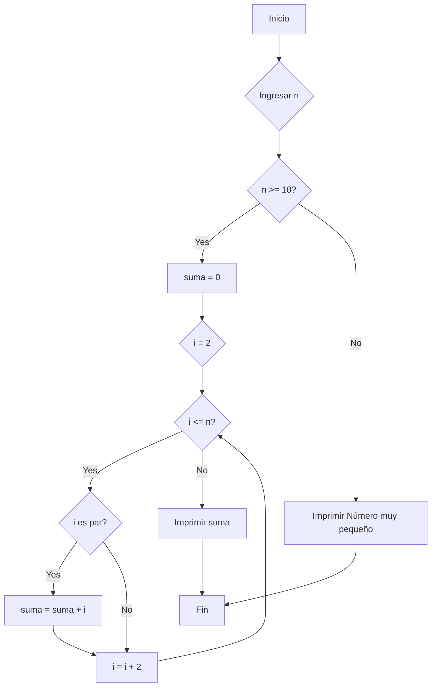

**1. Suma condicional de pares:**

*   **Diagrama de Flujo (Mermaid):**



*   **Pseudocódigo:**

```
INICIO
    ENTRADA n
    SI n >= 10 ENTONCES
        suma = 0
        PARA i = 2 HASTA n, INCREMENTO 2
            SI i es par ENTONCES
                suma = suma + i
            FINSI
        FINPARA
        IMPRIMIR suma
    SINO
        IMPRIMIR "Número muy pequeño"
    FINSI
FIN
```

*   **Código C++:**

```cpp
#include <iostream>

using namespace std;

int main() {
  int n, suma = 0;

  cout << "Ingrese un número entero positivo: ";
  cin >> n;

  if (n >= 10) {
    for (int i = 2; i <= n; i += 2) {
      suma += i;
    }
    cout << "La suma de los números pares desde 2 hasta " << n << " es: " << suma << endl;
  } else {
    cout << "Número muy pequeño. Debe ser mayor o igual a 10." << endl;
  }

  return 0;
}
```