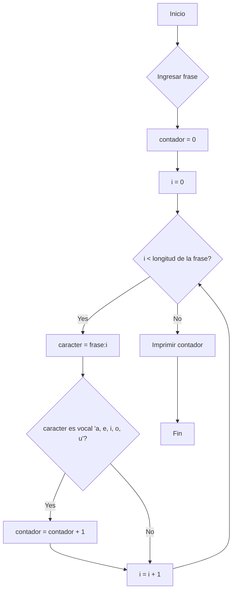

**4. Contador de vocales:**

*   **Diagrama de Flujo (Mermaid):**



*   **Pseudocódigo:**

```
INICIO
    ENTRADA frase
    contador = 0
    PARA i = 0 HASTA longitud(frase) - 1 HACER
        caracter = frase[i]
        SI caracter es 'a' o 'e' o 'i' o 'o' o 'u' o 'A' o 'E' o 'I' o 'O' o 'U' ENTONCES
            contador = contador + 1
        FINSI
    FINPARA
    IMPRIMIR contador
FIN
```

*   **Código C++:**

```cpp
#include <iostream>
#include <string>

using namespace std;

int main() {
  string frase;
  int contador = 0;

  cout << "Ingrese una frase: ";
  getline(cin, frase); // Para leer la frase completa

  for (int i = 0; i < frase.length(); ++i) {
    char caracter = tolower(frase[i]); // Convierte a minúscula para simplificar la comparación
    if (caracter == 'a' || caracter == 'e' || caracter == 'i' || caracter == 'o' || caracter == 'u') {
      contador++;
    }
  }

  cout << "La frase contiene " << contador << " vocales." << endl;

  return 0;
}
```